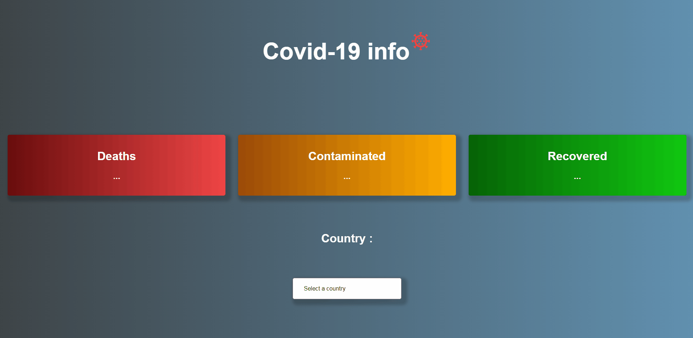

<h1 align='center'>Covid-19 info</h1>

<h2 align='center'>About</h2>

<h3 align='center'>Covid-19 info shows the covid-19 API information in the country selected by the user</h3>

## 🚀 Technologies

<ul>
    <li>Javascript</li>
    <li>html</li>
    <li>css</li>
</ul>

Made by João Pedro
